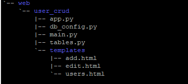

# REST-service-in-Python
Create a REST service with MySQL in python to provide CURD operation 

# First create directories. 
  Create a directory called web and inside web directory create user_crud directory. 
  Inside this user_crud directory create templates directory. 
  This templates directory will contain all html template files, such as we need several HTML files for creating CURD operations.

# Testing the Application
  Now navigate to the user_crud directory and execute the command `python main.py`, your server will start on default port 5000. If you want   to change the port then you can change the line `app.run()` to `app.run(port=50001)`, where 5001 is the new port.
  
  
  

